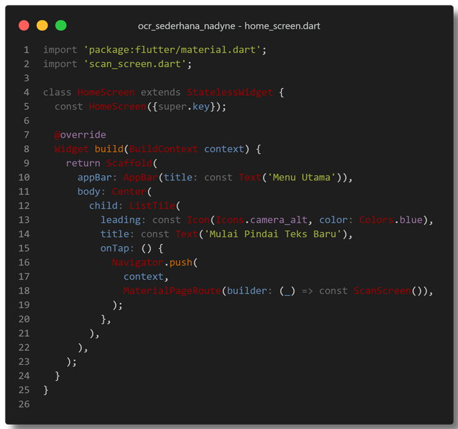
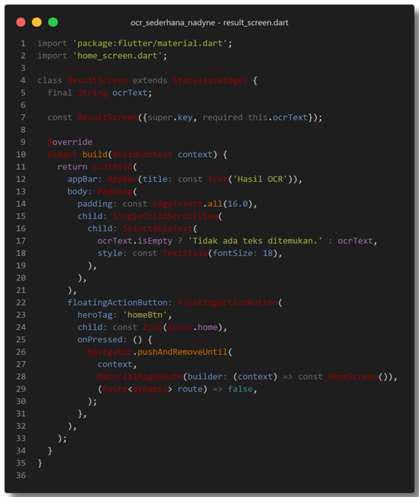
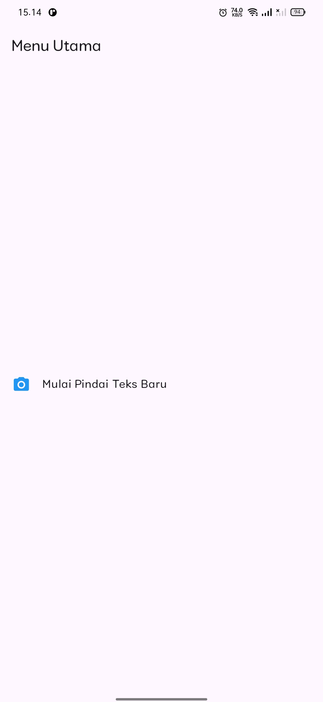
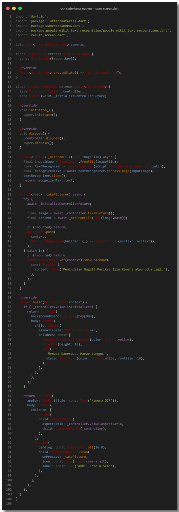
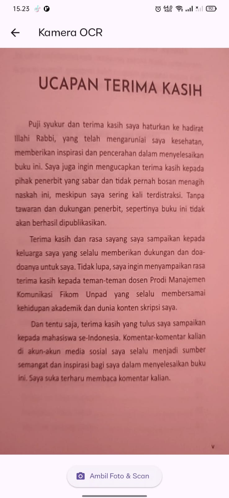
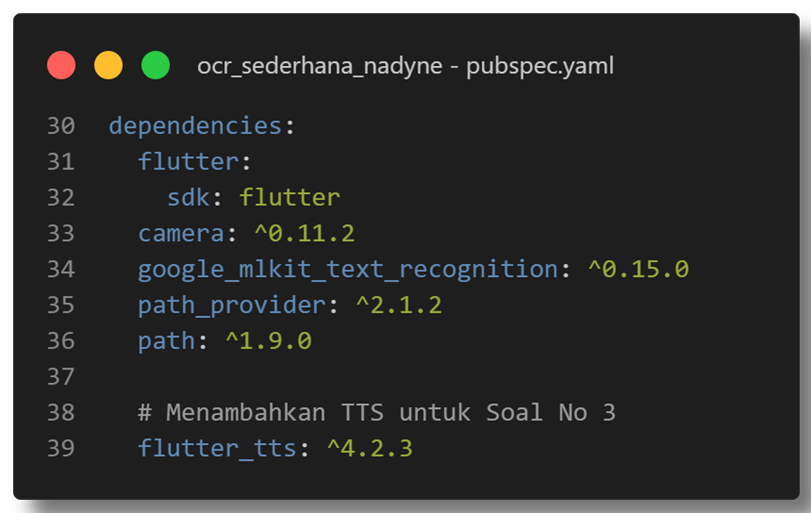
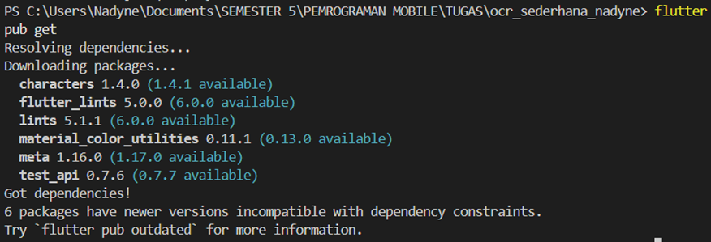
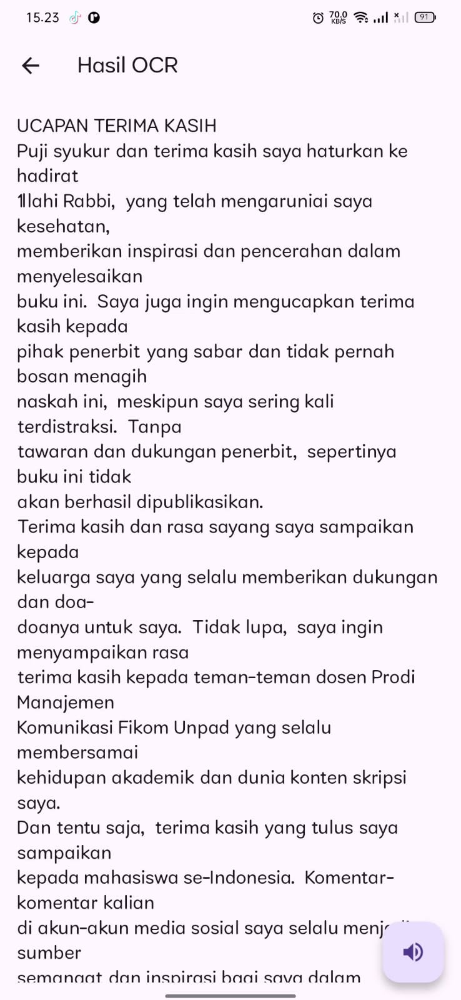

# ocr_sederhana_nadyne

# Laporan JS7 & UTS APLIKASI OCR SEDERHANA
**Nama:** Nadyne Rosalia Noer Azizah  
**NIM:** 2341760142  
**Kelas:** SIB-3F   
**Mata Kuliah:** Pemrograman Mobile - UTS
**Dosen Pengampu:** Ade Ismail S.Kom., M.TI  
**Prodi:** D-IV Sistem Informasi Bisnis  

**Note:** 
Pada praktikum ini dibuat aplikasi Flutter untuk melakukan pengenalan teks (OCR) menggunakan kamera perangkat dan Google ML Kit Text Recognition.
Aplikasi dapat memindai teks dari gambar dan menampilkannya dalam bentuk teks digital di layar.

🔹 Tujuan:
Mengintegrasikan kamera Flutter (camera),
Menggunakan Google ML Kit untuk membaca teks dari gambar,
Menampilkan hasil pengenalan teks ke layar hasil (ResultScreen).

🔹 Fitur:
Mengambil gambar menggunakan kamera,
Mengenali teks dari gambar menggunakan ML Kit,
Menampilkan hasil OCR secara akurat di layar hasil.

## SOAL 1: Modifikasi Struktur Navigasi dan Aliran

**Note:**  
-Mengubah tampilan HomeScreen menggunakan ListTile.
-Menambahkan tombol Home (FloatingActionButton) di ResultScreen agar bisa kebali ke menu utama dengan Navigator.pushAndRemoveUntil().
-Menghapus fungsi replaceAll('\n',' ') agar teks hasil OCR tampil utuh sesuai baris asli.

**Output & Dokumentasi:**

-------------

## SOAL 2: Penyesuaian Tampilan dan Penanganan State/Error

**Note:**  
-Mengubah tampilan loading kamera menjadi gelap (Colors.grey[900]) dengan teks “Memuat Kamera... Harap tunggu.”
-Mengubah pesan error di SnackBar menjadi:
"Pemindaian Gagal! Periksa Izin Kamera atau coba lagi."
-Menghapus $e agar error internal tidak ditampilkan.

**Output & Dokumentasi:**

-------------

## SOAL 3: Implementasi Plugin Text-to-Speech (TTS)

**Note:**  
-Mengubah ResultScreen dari StatelessWidget menjadi StatefulWidget.
-Menambahkan dan menginisialisasi FlutterTts di initState() dengan bahasa Bahasa Indonesia (id-ID).
-Membuat fungsi speak() untuk membacakan teks hasil OCR.
-Menambahkan FloatingActionButton dengan ikon 🔊 untuk memanggil speak().
-Menambahkan dispose() untuk menghentikan TTS saat halaman ditutup.

**Output & Dokumentasi:**

## Commit

## Kesimpulan:

Dari hasil implementasi Jobsheet 7 dan UTS Aplikasi OCR:
-Aplikasi OCR dapat berjalan stabil di emulator dan perangkat fisik.
-Fitur kamera, ML Kit, dan TTS bekerja dengan baik dan saling terintegrasi.
-Pengguna dapat memindai teks, melihat hasil, dan mendengarkan teks dibacakan secara otomatis.